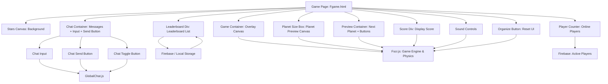

# 🌌 Planet Merge
### *"Forge the Cosmos, One World at a Time"*

<div align="center">

[](https://planet-merge.netlify.app/)
[](https://planet-merge.netlify.app/)

**An immersive physics-powered puzzle game where you merge celestial bodies to unlock the secrets of the universe**

[🎮 **Play Now**](https://planet-merge.netlify.app/) • [📖 **Documentation**](#project-structure) • [🛠️ **Tech Stack**](#tech-stack)

</div>

---

## 🎯 About

**Planet Merge** is a visually stunning space-themed puzzle game that
combines realistic physics with cosmic progression. Start with humble
asteroids and work your way up through planets, stars, and beyond to
reach the ultimate goal---creating a black hole! Each merge brings you
closer to mastering the cosmos.

------------------------------------------------------------------------

## ✨ Key Features

🌟 **Animated Starfield** -- Dynamic twinkling background creates an
authentic space atmosphere\
⚡ **Physics Engine** -- Realistic collisions and merges powered by
[Matter.js](https://brm.io/matter-js/)\
🌍 **Progression System** -- Evolve from asteroids → planets → stars →
black holes\
🛸 **UFO Overlay** -- Futuristic tractor beam guides your next strategic
move\
🎮 **Dual Game Modes** -- Switch between Arcade and Realistic physics
modes\
💬 **Global Chat** -- Chat in real-time with other players using
[Firebase](https://firebase.google.com/)\
🏆 **Global Leaderboard** -- Compete worldwide and keep your name
remembered using [Firebase](https://firebase.google.com/)\
🔍 **Zoom Controls** -- Press `Ctrl + scroll wheel` to zoom in/out for
optimal gameplay perspective\
👥 **Player Counter** -- See online players in real-time\
🧩 **Players Online Tab** -- Expandable UI to view the list of active
players in real-time\
📐 **Organize Button** -- Resets chat and player list windows back to
their original layout

------------------------------------------------------------------------

## 💬 Chat System

The game includes a **real-time global chat**, allowing players to
communicate and strategize during gameplay:

-   **Firebase-powered** -- messages are stored in real-time and
    synchronized for all players\
-   **Minimizable window** -- you can collapse the chat to save screen
    space
-   **Moveable** - you can move the chat window around to read messages
    while playing
-   **Notifications** -- unread messages are highlighted when the chat
    is minimized\
-   **Rate-limited messages** -- prevents spam by limiting message
    frequency\
-   **Name management** -- players can set or change their display name,
    which is shown in chat

------------------------------------------------------------------------

## 🛠️ Game Structure Diagram



-   **Game Canvas**: The main area where planets are dropped and
    merged.\
-   **Physics Engine / Matter.js**: Handles collisions, merges, and
    movement.\
-   **Planet Merge Logic**: Rules for combining celestial bodies.\
-   **Score / Progression**: Tracks points, largest planet, and game
    state.\
-   **Leaderboard Display**: Shows top scores in real-time (Firebase).\
-   **Players Online Tab**: Lets you see who's currently active
    in-game.\
-   **Organize Button**: Restores the chat and player counter back to
    their default positions.\
-   **UI Overlay**: Chat box, player counter, and control buttons.

------------------------------------------------------------------------

## 🚀 Quick Start

### Option 1: Play Online

Simply visit
**[planet-merge.netlify.app](https://planet-merge.netlify.app/)** and
start playing instantly!

### Option 2: Run Locally

``` bash
# Clone the repository
git clone https://github.com/yourusername/planet-merge.git
cd planet-merge

# Open in your browser
open index.html
# or double-click index.html
```

------------------------------------------------------------------------

## 🗂️ Project Structure

    planet-merge/
    ├── 📄 index.html              # Main landing page
    ├── 📄 README.md               # Project documentation
    ├── 📁 css/
    │   ├── 🎨 Fstyle.css          # Game styling
    │   └── 🎨 index.css           # Landing page styling
    ├── 📁 html/
    │   └── 🎮 Fgame.html          # Main game interface
    ├── 📁 img/
    │   └── 🪐 icons8-planet-32.png # Game icon
    └── 📁 js/
        └── ⚙️ Fscr.js            # Core game logic & physics

### 🔧 Core Components

-   **Game Engine**: [`js/Fscr.js`](js/Fscr.js) -- Game logic, physics,
    chat, and interactions\
-   **UI Templates**: [`index.html`](index.html) &
    [`html/Fgame.html`](html/Fgame.html) -- User interface\
-   **Styling**: [`css/Fstyle.css`](css/Fstyle.css) &
    [`css/index.css`](css/index.css) -- Visual design\
-   **Assets**: [`img/icons8-planet-32.png`](img/icons8-planet-32.png)
    -- Game graphics

------------------------------------------------------------------------

## 🛠️ Tech Stack

::: {align="center"}
  Technology               Purpose
  ------------------------ --------------------------------------------
  **HTML5 Canvas**         2D rendering and graphics
  **Matter.js**            Realistic physics simulation
  **CSS3 Animations**      Smooth UI transitions
  **Vanilla JavaScript**   Game logic and interactions
  **Firebase**             Real-time leaderboard, chat & players list
  **Netlify**              Deployment and hosting
:::

------------------------------------------------------------------------

## 🎮 How to Play

1.  **Drop Planets** -- Click to drop celestial bodies into the play
    area\
2.  **Merge Strategy** -- Combine identical objects to create larger
    ones\
3.  **Manage Space** -- Use the UFO's tractor beam to guide placement\
4.  **Evolve** -- Progress from asteroids → planets → stars → black
    holes\
5.  **Chat & Compete** -- Communicate with other players and submit your
    high scores\
6.  **See Players Online** -- Expand the players tab to view active
    users\
7.  **Organize UI** -- Use the organize button to reset windows to their
    default position

------------------------------------------------------------------------

## 📍 Milestones


## 🗓️ Development Roadmap

### ✅ Completed

-   [x] **Power-Up System** -- DELETE button (deletes first 3 planets)
    unlocks at Solara\
-   [x] **Visual Polish** -- Fixed planet selection indicators (now hot
    pink)\
-   [x] **Stackable Abilities** -- Delete ultimate stackable for
    strategy\
-   [x] **Players Online Tab** -- Added expandable window with real-time
    list\
-   [x] **Organize Button** -- Resets chat & players list back to their
    original position

### 🔄 In Progress

-   [ ] **Balance Update** -- Limit maximum delete uses\
-   [ ] **Performance** -- Optimize physics calculations for larger
    merges\
-   [ ] **Mobile Support** -- Touch controls & responsive UI

### 💭 Future Ideas

-   **Visual Effects** -- Particle systems for merges and events\
-   **Achievements** -- Milestone unlocks\
-   **Multiplayer** -- Real-time competitive merging battles

------------------------------------------------------------------------

## 🌟 Alternative Names Considered

*Planet Merge* • *Cosmic Fusion* • *Stellar Merge* • *Orbit Overlap* •
*Celestial Merge* • *AstroMerge* • *Planetary Puzzle* • *Merge the
Cosmos* • *Galactic Merge* • *Solar Synthesis* • *Nebula Merge* •
*Gravity Merge* • *Planet Stackers* • *Stellar Stack* • *Astro Alchemy*

------------------------------------------------------------------------

::: {align="center"}
> *"Merge, evolve, ascend. The universe awaits your mastery."*

**[🎮 Start Your Cosmic Journey](https://planet-merge.netlify.app/)**
:::
