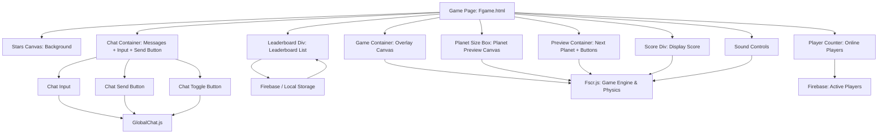

# 🌌 Planet Merge
### *"Forge the Cosmos, One World at a Time"*

<div align="center">

[](https://planet-merge.netlify.app/)
[](https://planet-merge.netlify.app/)

**An immersive physics-powered puzzle game where you merge celestial bodies to unlock the secrets of the universe**

[🎮 **Play Now**](https://planet-merge.netlify.app/) • [📖 **Documentation**](#project-structure) • [🛠️ **Tech Stack**](#tech-stack)

</div>

---

## 🎯 About

**Planet Merge** is a visually stunning space-themed puzzle game that combines realistic physics with cosmic progression. Start with humble asteroids and work your way up through planets, stars, and beyond to reach the ultimate goal—creating a black hole! Each merge brings you closer to mastering the cosmos.

---

## ✨ Key Features

🌟 **Animated Starfield** – Dynamic twinkling background creates an authentic space atmosphere  
⚡ **Physics Engine** – Realistic collisions and merges powered by [Matter.js](https://brm.io/matter-js/)  
🌍 **Progression System** – Evolve from asteroids → planets → stars → black holes  
🛸 **UFO Overlay** – Futuristic tractor beam guides your next strategic move  
🎮 **Dual Game Modes** – Switch between Arcade and Realistic physics modes  
💬 **Global Chat** – Chat in real-time with other players using [Firebase](https://firebase.google.com/)  
🏆 **Global Leaderboard** – Compete worldwide and keep your name remembered using [Firebase](https://firebase.google.com/)   
🔍 **Zoom Controls** – Press `Ctrl + scroll wheel` to zoom in/out for optimal gameplay perspective  
👥 **Player Counter** – See online players in real-time  

---

## 💬 Chat System

The game includes a **real-time global chat**, allowing players to communicate and strategize during gameplay:

- **Firebase-powered** – messages are stored in real-time and synchronized for all players  
- **Minimizable window** – you can collapse the chat to save screen space
- **Moveable** - you can move the chat window around to read messages while playing
- **Notifications** – unread messages are highlighted when the chat is minimized  
- **Rate-limited messages** – prevents spam by limiting message frequency  
- **Name management** – players can set or change their display name, which is shown in chat  

---

## 🛠️ Game Structure Diagram



- **Game Canvas**: The main area where planets are dropped and merged.  
- **Physics Engine / Matter.js**: Handles collisions, merges, and movement.  
- **Planet Merge Logic**: Rules for combining celestial bodies.  
- **Score / Progression**: Tracks points, largest planet, and game state.  
- **Leaderboard Display**: Shows top scores in real-time (Firebase).  
- **UI Overlay**: Chat box, player counter, and control buttons.
  


---

## 🚀 Quick Start

### Option 1: Play Online
Simply visit **[planet-merge.netlify.app](https://planet-merge.netlify.app/)** and start playing instantly!

### Option 2: Run Locally
```bash
# Clone the repository
git clone https://github.com/yourusername/planet-merge.git
cd planet-merge

# Open in your browser
open index.html
# or double-click index.html
```

---

## 🗂️ Project Structure

```
planet-merge/
├── 📄 index.html              # Main landing page
├── 📄 README.md               # Project documentation
├── 📁 css/
│   ├── 🎨 Fstyle.css          # Game styling
│   └── 🎨 index.css           # Landing page styling
├── 📁 html/
│   └── 🎮 Fgame.html          # Main game interface
├── 📁 img/
│   └── 🪐 icons8-planet-32.png # Game icon
└── 📁 js/
    └── ⚙️ Fscr.js            # Core game logic & physics
```

### 🔧 Core Components
- **Game Engine**: [`js/Fscr.js`](js/Fscr.js) – Game logic, physics, chat, and interactions  
- **UI Templates**: [`index.html`](index.html) & [`html/Fgame.html`](html/Fgame.html) – User interface  
- **Styling**: [`css/Fstyle.css`](css/Fstyle.css) & [`css/index.css`](css/index.css) – Visual design  
- **Assets**: [`img/icons8-planet-32.png`](img/icons8-planet-32.png) – Game graphics  

---

## 🛠️ Tech Stack

<div align="center">

| Technology | Purpose |
|------------|---------|
| **HTML5 Canvas** | 2D rendering and graphics |
| **Matter.js** | Realistic physics simulation |
| **CSS3 Animations** | Smooth UI transitions |
| **Vanilla JavaScript** | Game logic and interactions |
| **Firebase** | Real-time leaderboard & chat database |
| **Netlify** | Deployment and hosting |

</div>

---

## 🎮 How to Play

1. **Drop Planets** – Click to drop celestial bodies into the play area  
2. **Merge Strategy** – Combine identical objects to create larger ones  
3. **Manage Space** – Use the UFO's tractor beam to guide placement  
4. **Evolve** – Progress from asteroids → planets → stars → black holes  
5. **Chat & Compete** – Communicate with other players and submit your high scores  

---

## 🗓️ Development Roadmap

### ✅ Completed
- [x] **Power-Up System** – DELETE button (deletes first 3 planets) unlocks at Solara  
- [x] **Visual Polish** – Fixed planet selection indicators (now hot pink)  
- [x] **Stackable Abilities** – Delete ultimate stackable for strategy  

### 🔄 In Progress
- [ ] **Balance Update** – Limit maximum delete uses  
- [ ] **Performance** – Optimize physics calculations for larger merges  
- [ ] **Mobile Support** – Touch controls & responsive UI  

### 💭 Future Ideas
- **Visual Effects** – Particle systems for merges and events  
- **Achievements** – Milestone unlocks  
- **Multiplayer** – Real-time competitive merging battles  

---

## 🌟 Alternative Names Considered
*Planet Merge* • *Cosmic Fusion* • *Stellar Merge* • *Orbit Overlap* • *Celestial Merge* • *AstroMerge* • *Planetary Puzzle* • *Merge the Cosmos* • *Galactic Merge* • *Solar Synthesis* • *Nebula Merge* • *Gravity Merge* • *Planet Stackers* • *Stellar Stack* • *Astro Alchemy*  

---

<div align="center">

> *"Merge, evolve, ascend. The universe awaits your mastery."*

**[🎮 Start Your Cosmic Journey](https://planet-merge.netlify.app/)**

</div>
